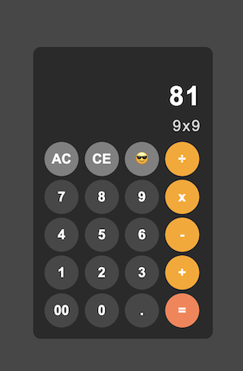

# ## Vanilla Javascript Projects

# A collection of simple projects built with vanilla JavaScript.

# Each project is designed to be a standalone application, showcasing different features and functionalities of JavaScript.

# Feel free to explore, modify, and use these projects as a reference for your own work.

## Features

<!-- - Responsive design (For bigger projects) -->

- Logic and functionality implemented using vanilla JavaScript
- No external libraries or frameworks used
- Clean and modular code structure
- Easy to understand and modify
- Basic styling using CSS
- Simple and intuitive user interfaces

# ## Projects (...so far 😅)

# 1. [Calculator](./calculator)

# 2. [Swiper](./swiper)

# ## Screenshots

# 

# 

# ## How to clone this repo

# ```bash

# git clone https://github.com/agwebryanmuna/Vanilla-Javascript-projects.git
